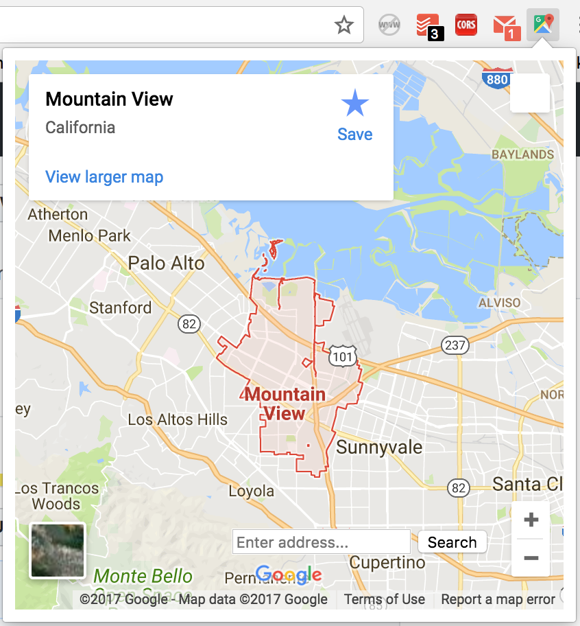

# GMaps Chrome Extension
Chrome Extension for looking up places in GoogleMaps.

## Install
1. git clone https://github.com/nagam11/Extension-GoogleMaps.git
2. Navigate to [chrome://extensions](chrome://extensions).
3. Click on 'Load unpacked extension' and select the cloned directory

## Functionality
### Inside Search
Enter a place in the bottom field of the extension to search in Google Maps.
### Outside Search
Right-click an address on any page and click on 'Search in Maps' button. A new tab will redirect you to the search result in Maps.
